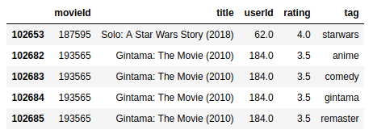

# EECS 731 Jimmy Wrangler, Data Explorer (Assignment # 01)

### Quick Note:
If you are interested in only looking at notebook, please access the notebook in **/notebooks/data_explorer.ipynb**.

/notebooks: Contains the notebook of this assignment.

/data: Contains the data csv files (movies.csv, ratings.csv, tags.csv)

Also, some content of this assignment and my assignment # 03 (Weekend Movie Trip) notebook will be similar, as I have used the same datasets for both assignments.

### Objective:

Traveling the world on a mission to discover new data

1. Set up a data science project structure in a new git repository in your GitHub account

2. Install Jupyter notebook prerequisites (Anaconda, Python, etc.)

3. Select an industry

4. Select two to three public data sets from that industry

5. Load the data sets into panda data frames following the 10 minutes to pandas guide

6. Formulate one or two ideas on how the data sets could be combined to establish
additional value using exploratory data analysis

7. Transform the data sets into a single data set while following data preparation processes
to clean and transform features (use pandas documentation for help)

8. Document your process and results

9. Commit your notebook, source code, visualizations and other supporting files to the git
repository in GitHub

### Datasets:

For this assignment, I took three datasets from the MovieLens Website (https://grouplens.org/datasets/movielens/), namely **Movies, Ratings, and Tags datasets**. First, we do exploratory analysis on each dataset separately, followed by cleaning and merging (those datasets into one) process (Data csv files are in /data/ directory of this repository).

### Process:

<ul>
<li>First I loaded and inspected the three data csv files (movies.csv, ratings.csv, tags.csv), so I can explore and combine MOVIES, RATINGS, and TAGS information from them for data exploration. (Please see the /notebooks/data_explorer.ipynb for more details)</li>
<li>Then, we merge the information from these data frames into a new data frame that contains MOVIES, THEIR RATINGS AND TAGS VECTORS.</li>

*The process and results are detailed as follows, as well as in /notebooks/data_explorer.ipynb notebook.*

### Discussion and Results:

First, we do exploratory analysis on each dataset separately, followed by cleaning and merging (those datasets into one) process.

**Movies Dataset Analysis:**

As shown above, the movies csv file contains total **9724** unique movies. Consequenly, from the table, it is evident that it provides movies names and their **genre**. We can use the **genre** and **title** features for data modeling purpose (e.g. Clustering similar movies together).

**Ratings Dataset Analysis**

As seen above, **610** users participated in movie ratings for **9724** unique movies. This dataset also has timestamp that may be useful in time based analysis or modeling. But for this assignment, for merging process later, I dropped this feature being not useful (as part of **feautre engineering/cleaning process**).

**Tags Dataset Analysis**

The tag dataset csv file contains tags that are given by the users to different movies. As shown above, **1572 (out of total 9724)** movies have been given total **1460** tags or keywords by **58 (out of total 610)** unique and different users. The tag feature assigned to different movies can be used again for different data modeling tasks (e.g. Clustering based modeling).

# Datsets Feature Engineering and Merging Process

Next, we are merging different datapoints into single dataset that can be used for further process (e.g. Data Modeling for classification, clustering or regression purpose).

First, we **merge** *movies* and *ratings* data frames based on common *movieId* feature, followed by merging the resultant table with tags table based on *movieId* and *userId* featues.

As we can see that there are some NaN values in the resultant table. So, we **drop** rows with any NaN value.

This final dataframe also has some interesting insights, as follows:

**Unique Users :  54**

**Unique Movies :  1464**

**Unique Tags :  1424**

Consequently, number of row are reduced from *1,02,695* to just *3,476* rows, but more cleaner and ready to be used by data modeling process. This final table can be used for any modeling purpose, especially for Cluster based recommendation system. I have also given the clustering process as follows, which is not required by the given assignment,thus, optional part that can be skipped/ignored.

**Based on the above final table, I have also given the clustering process in this assignment notebook, which is not required by the given assignment, thus, optional part that can be skipped/ignored.**

# Conclusion

This was the basic data science assignment, but, I believe this was the **most important data science asignment**. Because data cleaning/ feature engineering process is vital before doing any data modeling stuff. As there is a famous term in data science and machine/deep learning community for importance of data pre-processing, i.e. GIGO (Garbage In, Garbage Out). So, in my opinion, this assingment was very important and useful for me to understand the baseics of data pre-processing. So, first we loaded three separate datasets, followed by merging them into a single table based on some common features/fields. Along the way, we also did cleaning/feature engineering on these tables e.g. Dropping NaN values.

# References

1. https://github.com/usajid/731_assign3
